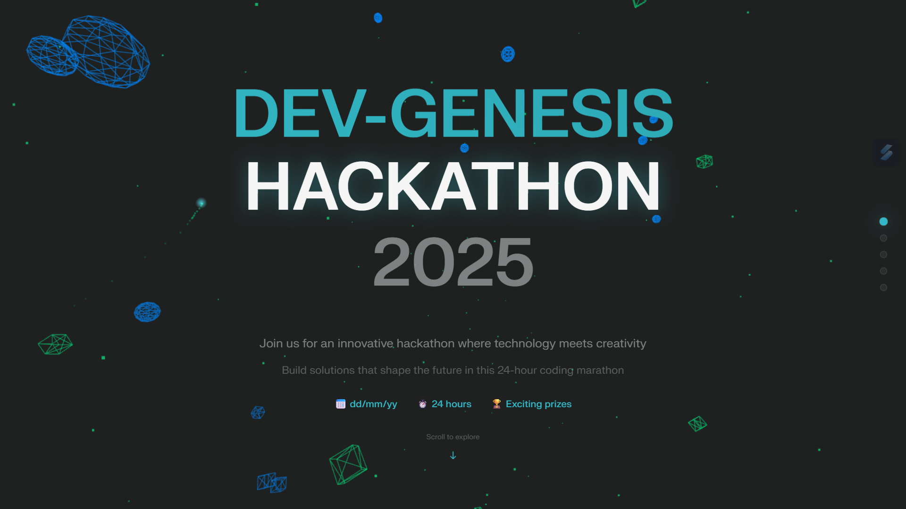
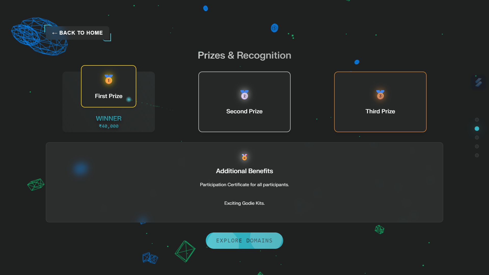
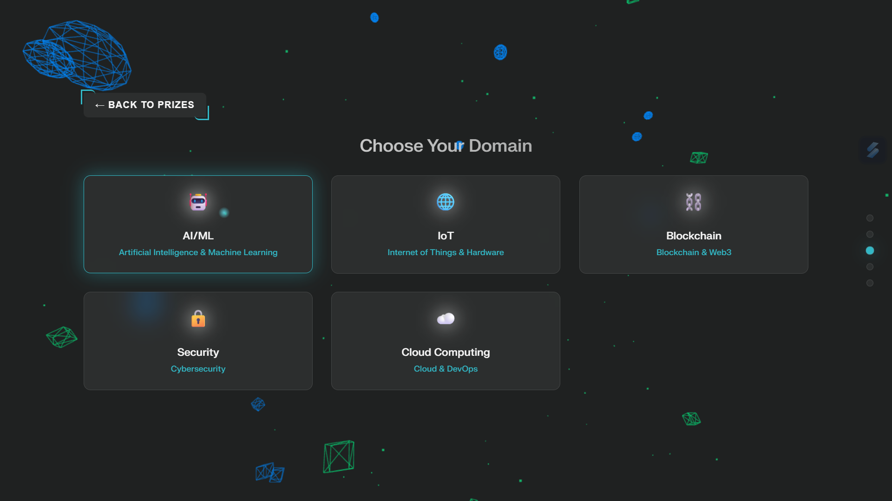
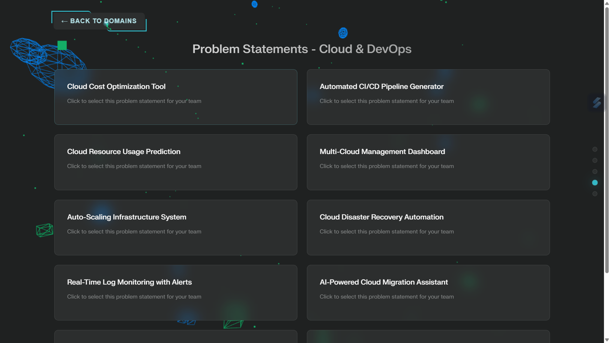
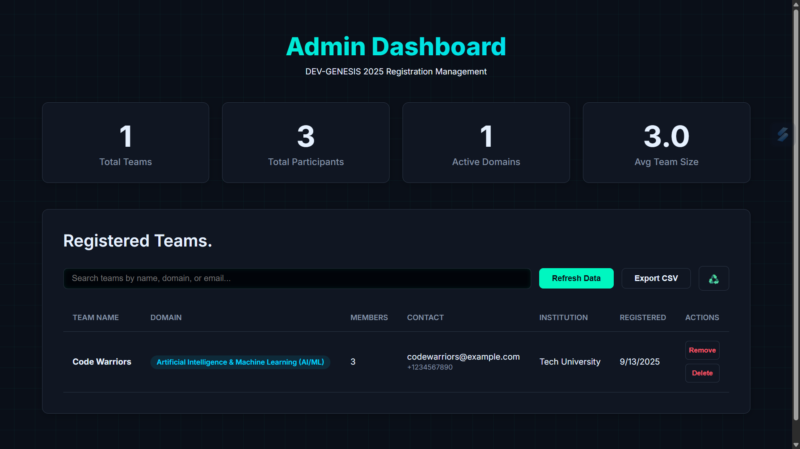
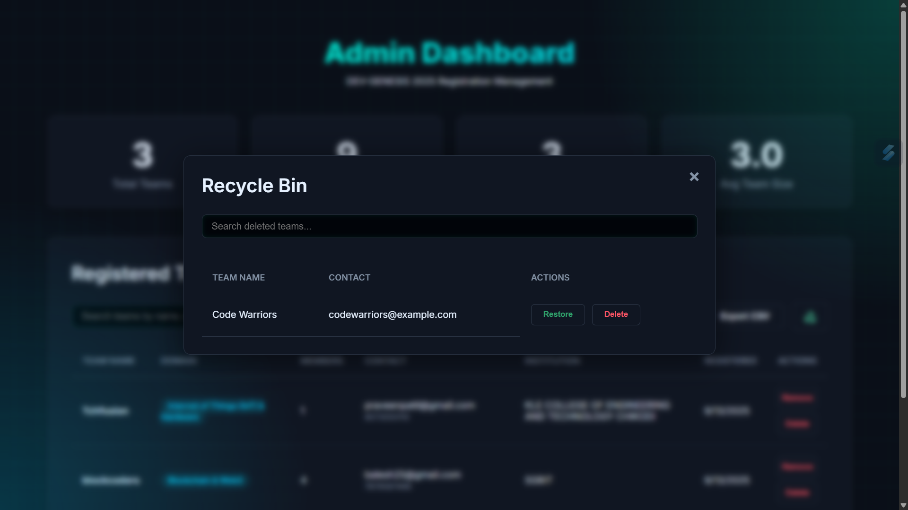

# DEV-GENESIS 2025: Full-Stack Registration Platform

 

A comprehensive, full-stack application designed to manage registrations for the **DEV-GENESIS 2025 Hackathon**. This project features a sleek, animated public-facing website for participants and a powerful, secure admin dashboard for organizers to manage the event seamlessly.

 

---

## ✨ Core Features

This application is architected as two primary components: a dynamic public portal and a private administrative dashboard.

###  Frontend (Public Registration Portal)
- **Stunning & Modern UI:** A fully responsive, animated user interface built with pure, framework-free HTML, CSS, and Vanilla JavaScript to ensure maximum performance.
- **3D Animated Background:** Utilizes **Three.js** to create a captivating and memorable user experience with interactive 3D particles and shapes.
- **Guided Multi-Step Registration:** An intuitive, step-by-step process for users to select a hackathon domain, choose a problem statement, and register their team details.
- **Dynamic Content Loading:** All hackathon data, including domains, problem statements, and prize information, is dynamically loaded from a single JavaScript object (`app.js`), making future updates effortless.

### Backend & Admin Dashboard
- **Full-Featured Admin Panel:** A secure, private dashboard for event organizers to monitor and manage all aspects of the registration process.
- **Real-time Analytics:** An at-a-glance dashboard displaying live statistics:
    - Total Registered Teams
    - Total Participant Count
    - Domain-wise Team Distribution
    - Average Team Size
- **Complete Team Management:** Full CRUD (Create, Read, Update, Delete) capabilities for all team registrations.
- **Safe Deletion (Recycle Bin):** A soft-delete feature moves accidentally deleted teams to a Recycle Bin, allowing for easy, one-click restoration of a team and all its members.
- **Permanent Deletion:** A secure option to permanently erase team data from the database, available from both the main view and the recycle bin.
- **Powerful Search:** Live search functionality is implemented on both the main dashboard and within the Recycle Bin modal.
- **Export to CSV:** A one-click feature to download all registration data as a neatly formatted CSV file.

---

## 🛠️ Technology Stack

- **Backend:** Node.js, Express.js
- **Database:** MySQL 2 (with connection pooling and atomic transactions)
- **Frontend:**
    - **Portal:** HTML5, CSS3, Vanilla JavaScript (ES6+)
    - **Admin:** HTML5, CSS3, Vanilla JavaScript (ES6+)
- **3D Graphics:** Three.js
- **Development & Tooling:**
    - `nodemon` for live server reloading during development
    - `dotenv` for secure management of environment variables

---

## 🚀 Getting Started

Follow these instructions to set up and run the project on your local machine for development and testing purposes.

### Prerequisites
- **Node.js:** v14.x or higher
- **npm:** v6.x or higher (usually comes with Node.js)
- **MySQL:** A running instance of a MySQL server.

### All-in-One Setup & Run Command Block

Open your terminal and run these commands one by one:

1. Clone the repository (replace with your actual URL)
https://github.com/masoommulla/hackathon-registration.git

2. Navigate into the project directory
cd hackathon-registration

3. Install all the required Node.js packages
npm install

4. Create the .env file with your credentials
(Remember to replace 'your_mysql_password' with your actual password)
echo "DB_HOST=localhost
DB_USER=root
DB_PASSWORD=your_mysql_password
DB_NAME=hackathon_db
DB_PORT=3306" > .env

5. Initialize the database (creates tables and adds sample data)
node init-database.js

6. Start the server in development mode (with auto-restart)
npm run dev

After these steps, the server will be running on **`http://localhost:3000`**.

- **Public Portal:** `http://localhost:3000/`
- **Admin Dashboard:** `http://localhost:3000/admin`

---

## 📁 Project Structure

A brief overview of the key files and directories in this project.
├── public/
│ ├── admin.html # The admin dashboard UI
│ ├── admin.js # Logic for the admin dashboard
│ ├── admin.css # Styling for the admin dashboard
│ ├── index.html # The main registration portal UI
│ ├── app.js # Logic and data for the registration portal
│ └── style.css # Styling for the registration portal
├── .env # Secure environment variables (private)
├── scripts
| └──init-database.js # Script to set up and seed the database
├── package.json # Project metadata and dependencies
├── server.js # The main Express.js backend server
└── README.md # This file!

---

## 🌟 Contributing

Contributions are what make the open-source community an amazing place to learn, create, and inspire. Any contributions you make are **greatly appreciated**.

If you have a suggestion that would make this better, please fork the repo and create a pull request. You can also simply open an issue with the tag "enhancement".

1.  Fork the Project
2.  Create your Feature Branch (`git checkout -b feature/AmazingFeature`)
3.  Commit your Changes (`git commit -m 'Add some AmazingFeature'`)
4.  Push to the Branch (`git push origin feature/AmazingFeature`)
5.  Open a Pull Request

---

## 📜 License

This project is distributed under the MIT License.

---
**Happy Hacking!** 🚀
